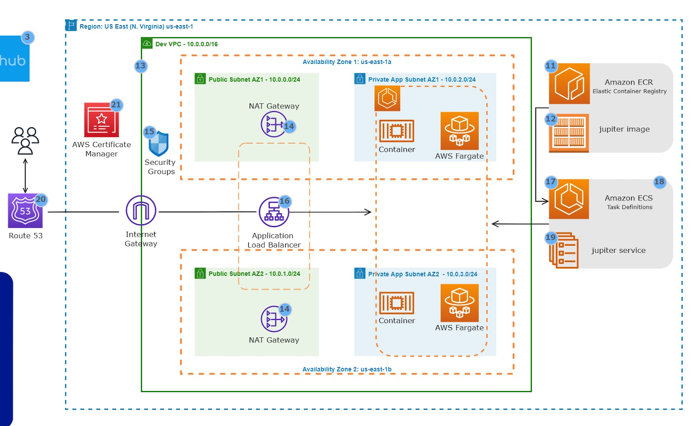

# DevOps Project: Hosting Static Web App with Docker on AWS

This project demonstrates the deployment of a static web application using Docker on AWS infrastructure. The goal is to provide a comprehensive guide for setting up, building, and deploying a containerized web application with various AWS services. The project leverages GitHub for version control, Docker Hub for image storage, and AWS for hosting and managing the application.

## Summary

The project involves the following key steps:

1. **GitHub Repository Setup:**
   - Create a GitHub repository to store the Dockerfile.
   - Clone the repository to your local machine for development.

2. **Docker and Docker Hub:**
   - Sign up for a Docker Hub account.
   - Download and install Docker on your computer.
   - Create a Dockerfile for building the container image.
   - Build, start, and push the Docker image to your Docker Hub repository.

3. **AWS Infrastructure:**
   - Install AWS CLI, create IAM User, and set up a named profile.
   - Create an Amazon ECR Repository for storing Docker images.
   - Set up a VPC with public and private subnets, including resources like Nat Gateway, Bastion Host, and Application Load Balancer.
   - Create Security Groups, an ECS Cluster, and a Task Definition.
   - Use an Application Load Balancer to distribute web traffic to containers.
  
4. **Additional AWS Services:**
   - Utilize Route 53 for domain registration and record set creation.
   - Use AWS Certificate Manager to secure web communications with SSL/TLS.

5. **Scripts in VS Code:**
   - A set of useful scripts for building, managing, and pushing Docker images to repositories on Docker Hub and AWS ECR.

## Usage

### Scripts in VS Code
```bash
# Build image
docker build -t <tag-name> .

# List all built images
docker image ls

# Start container
docker run -dp 80:80 <image-name>

# List running containers
docker ps

# Stop container
docker stop <container-id>

# Login to Docker Hub
login -u <username>

# Change Docker container image name
docker tag <old-name> <username>/<new-name>

# Push image to Docker repository
docker push <username>/<name-of-image>

# Push image to AWS ECR
aws ecr create-repository --repository-name <image-name> --region <region-name>

# Tag an image for AWS ECR
docker tag <tag-name> <ecr-uri>

# Retag Docker image
docker tag <old-tag-name> <ecr-uri>/<old-tag-name>

# Login to ECR
aws ecr get-login-password | docker login --username AWS --password-stdin <ecr-uri>

# Push Docker image to ECR repository
docker push <new-tag-name>
```
